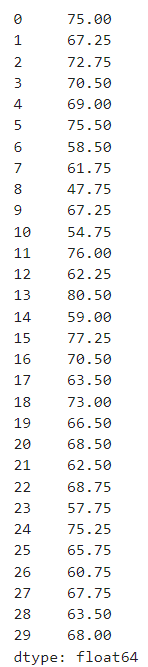
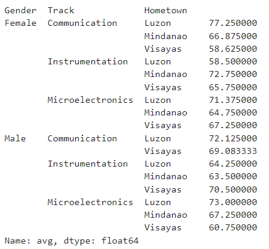

# EXPERIMENT 4 - Data Wrangling and Visualization
### Problem:
ECE BOARD EXAM PROBLEM: Using data wrangling and data visualization technique with storytelling, analyze the data and present different (i) data frames; and (ii) visuals using the dataset given.

P1: 

Create the following data frames based on the format provided:

Example: Vis = ["Name", "Gender", "Track", "Math<70"]
  
* Filename: Instru = [“Name”, “GEAS”, “Electronics >70”]; where track is constant as Instrumentation and hometown Luzon

* Filename: Mindy = [ “Name”, “Track”, “Electronics”, “Average >=55”]; where hometown is constant as Mindanao and gender Female

P2: 

using the same data frame:
* Create a visualization that shows how the different features contributes to average grade. Does chosen track in college, gender, or hometown contributes to a higher average score?

## Background
#### Data
is the representation of raw elements or unprocessed facts, including numbers and symbols to text and images.
#### Data Wrangling
also called data munching, involves manipulation and tranformation of data frames in preparation for data analytics.
#### Data visualization
is the graphical representation of any informati or data. It provides a way of understanding trends, outliers, and patterns in data. Thus, it is a mean of turning numerical data into a "story" that can convey a significant or key message.

## How to solve the problem using Data Wrangling and Visualization?
* To begin with, you must learn and identify the codes and functions incorporated in the Data Wrangling and Visualization library.
* I used Anaconda Navigator that has Jupyter Notebook pre-installed which I used for coding.

## For P1:
#### Create the following data frames based on the format provided:
#### Example: Vis = [“Name”, “Gender”, “Track”, “Math<70”]; hometown is constant as Visayas

## For P1.A:
#### Filename: Instru = [“Name”, “GEAS”, “Electronics >70”]; where track is constant as Instrumentation and hometown Luzon
1. Download the corresponding xlsx file (board2.xlsx) in order for us to obtain the data we need.
---
2. Create a jupyter notebook that has the same file location with the downloaded xlsx file.
---
3. Start the coding by assessing the Pandas library: 'import pandas as np'. In this problem, we need to access Pandas library because Python Data Analysis functions will be useful in creating the data frame.
---
4. Use the read function for xlsx files that will read and load the data in the data frame.
---
5. With the data frame loaded, use the loc function to filter the data frame which will return the values of 'Instrumentation' for 'Track, 'Luzon' for 'Hometown' which will serve as constants for the other values. Return the values of 'GEAS' and greater than 70 'Electronics' values.
---
6. Save the file for output.

## For P1.B:
#### Filename: Mindy = [ “Name”, “Track”, “Electronics”, “Average >=55”]; where hometown is constant as Mindanao and gender Female
---
1. Since we need to return the 'Average' values of the subjects, we need to combine all the subjects and use the mean function of Data Wrangling.
---
2. Use the similar method in coding P1A, but this time filter the data which will return the value of 'Female' in 'Gender' and 'Mindanao' for 'Hometown' serving as constants for the other values. Return the values of 'Name', 'Track', 'Electronics', and greater than or equal to 55 'Average' values.
---
3. Save the file for ouput.

## For P2:
#### Create a visualization that shows how the different features contributes to average grade. Does chosen track in college, gender, or hometown contributes to a higher average score?
---
1.  Start the coding by accessing the Pandas, Mathplotlib, and Seaborn libraries.
---
2. Load the similar xlsx file that we have used in the previous problems.
---
3. Get the average of the four subjects for each student in the data frame by using the mean function with axis=1 meaning the calculation will be performed across the columns for each row (student).
---
4. Group the data frame by three columns. With the use of the grouped data we need to take the average of the students with respect to their 'Gender', 'Track', and 'Hometown' values.
---
5. Using matplotlib and seaborn functions, plot the bar graph that will show the contribution of gender, track in college, and hometown in gaining a high average.

## Output

This is my output for loading the 'board2.xlsx' file.

---

This is my output for P1.A.

---

This is my output for P1.B.

---

This is my output for getting the average grade of the students for all the subjects.

---

This is my output for getting the average for the different features (Gender, Track, Hometown).

---

This is my output for the visualization of the contribution of gender in gaining a high average. It shows that Male gender's contribution in gaining a high average is higher than Female.

---

This is my output for the visualization of the contribution of track in gaining a high average. It shows that Communication is the highest, followed by Microelectronics, and Instrumentation.

---

This is my output for the visualization of the contribution of hometown in gaining a high average. It shows that Luzon is the highest, followed by Mindanao and Visayas.

## Author
Pangan, Raven G.
## References
* ECE2112 Lecture Notes by Prof. Engr. Ma. Madecheen S. Pangaliman, MSc and Prof. Engr. Nico John Leo S. Lobos, MSc, ECE, ECT
* README.md file by SuperMadee

